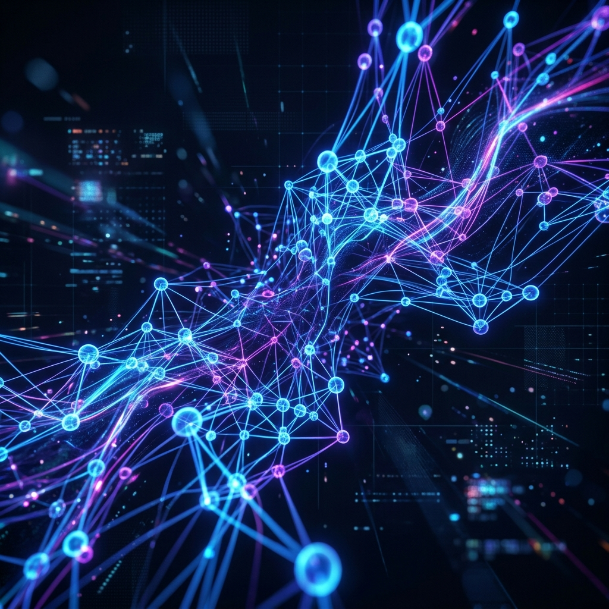

<!-- Animated Header Banner -->

 

<table align="center" style="border: none;">
  <tr>
    <td width="35%" align="center" valign="middle">
      <!-- Your pasted profile image -->
      
    </td>
    <td width="65%" align="center" valign="middle">
      <!-- Typing Animation -->
      
        
      <!-- Badges -->
      
      
      
        
      
    </td>
  </tr>
</table>

---

## 💫 About Me

*   🎓 Pursuing **B.E. in Artificial Intelligence & Machine Learning** at BNM Institute of Technology (CGPA: 9.5/10)
*   💻 Currently an **AI Engineer Intern** at Matrix Maven, building compliance intelligence platforms.
*   🧠 Deeply interested in **LLMs, RAG, Prompt Engineering**, and building **Agentic AI workflows**.
*   🏆 **3x Hackathon Winner** (including NASSCOM National Hackathon & IBM Mindscape).
*   🌱 Always learning new technologies and exploring real-world AI applications.
*   💼 **Open to exciting opportunities** in Software Engineering and AI/ML roles.

---

## 🛠️ Tech Stack

### Languages

### Full-Stack & Backend

### AI & Machine Learning

### Databases & Tools

---

## 📊 GitHub Analytics

  
  

  
  

---

  

 

## 🚀 Featured Projects

| Project | Description | Technologies |
| :--- | :--- | :--- |
| **[ShieldSphere](https://github.com/Vibhakash/ShieldSphere)** | Enterprise Account Security Platform with real-time login monitoring, geolocation tracking, and intelligent threat detection. | `FastAPI`, `Next.js`, `PostgreSQL` |
| **[ProjectPulse](https://github.com/Vibhakash/ProjectPulse)** | Intelligent project health reporting agent leveraging deterministic RAG status scoring and LLM sentiment analysis. | `Python`, `React`, `LLMs` |
| **[MedVault](https://github.com/Vibhakash/MedVault)** | Healthcare Document Privacy Platform ensuring HIPAA compliance through AI-powered PII detection and automated redaction. | `FastAPI`, `Next.js`, `NLP`, `OpenCV` |
| **[ClimaX](https://github.com/Vibhakash/ClimaX)** | AI-Powered Disaster Risk Prediction System built on historical weather/satellite datasets (88% accuracy). | `Machine Learning`, `FastAPI` |
| **[NavAIgator](https://github.com/Vibhakash/NavAIgator)** | Optimized Ship Routing platform using real-time data and a modified HAC-PSO algorithm for route optimization. | `AI`, `Web Development` |

> 💡 *Check out my repositories for more detailed READMEs, architectures, and live demos!*

## 💼 Experience & Achievements

### 🏢 Experience
*   **AI Engineer Intern** @ *Matrix Maven* (Feb 2026 – May 2026)
    *   Built a compliance intelligence platform modeling ISO 27000, SOC 2 in Neo4j.
    *   Developed agentic AI workflows using LangChain and LangGraph for automation.
*   **Full Stack Development Intern** @ *AidelTecz* (May 2025 – Jun 2025)
    *   Developed a real-time car booking platform with FastAPI, MongoDB, and Socket.IO.

### 🏆 Notable Achievements
*   🥈 **2nd Runners up** — NASSCOM National Hackathon (out of 6000 teams).
*   🥈 **Runners up** — IBM Mindscape National Level Hackathon 2025.
*   🎤 **Presenter** — Showcased *ClimaX* at NASSCOM Confluence 2025.
*   💡 **Most Innovative Project** — Eureka 2025 IITB Pitchathon (Runners up).
*   🥈 **Runners up** — GenX Generative AI Hackathon 2026.

---

## 📜 Certifications

*   🛡️ **CompTIA Security+ (SY0-701)** — CompTIA
*   🧠 **Introduction to Model Context Protocol, AI Fluency** — Anthropic (2026)
*   🤖 **Use of Generative AI for Software Development** — IBM
*   🔌 **Postman API Fundamentals Student Expert Certification**

---

<!-- Footer Animation -->

  <i>Let's connect and build something amazing together!</i>

